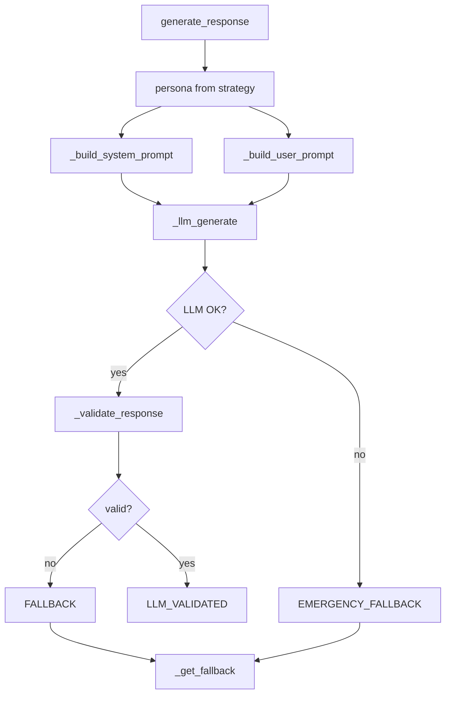
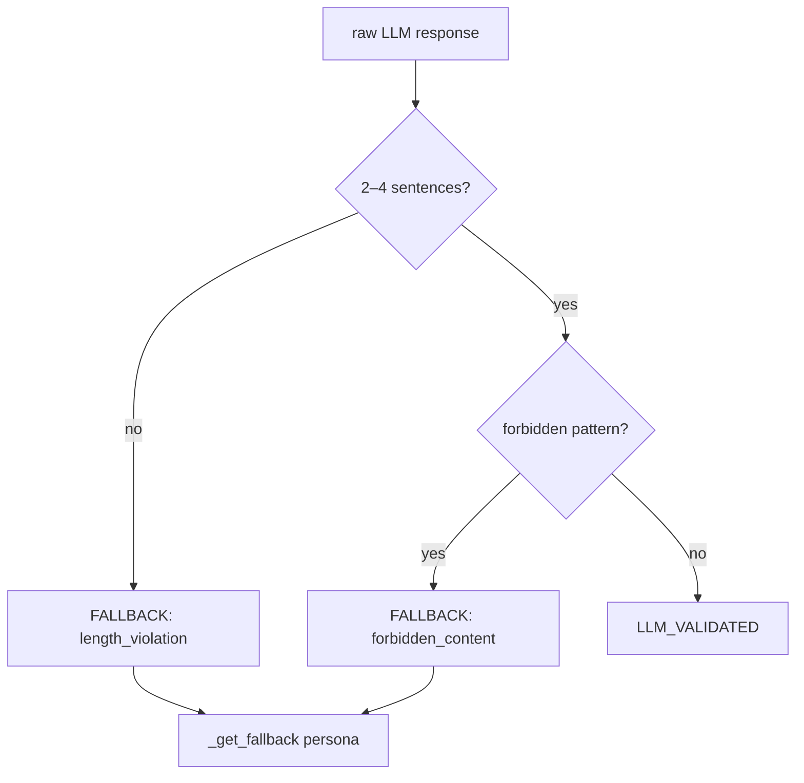

# Engagement Agent – Documentation

A clear guide to the **EngagementAgent**: what it does, how it works, and how to use it.

---

## What is the Engagement Agent?

The **Engagement Agent** generates believable honeypot replies to scammer messages. It plays one of three **personas** (NAIVE, AVERAGE, TECH_SAVVY), uses an **LLM** for natural language, and **validates** every reply so we never leak OTP/PIN/password or reveal that we’re a bot. If the LLM fails or the reply fails validation, we use **fallback** responses for 100% uptime.

- **Code:** `agents/engagement_agent.py`
- **Base class:** `BaseAgent`
- **Aligns with:** GUVI spec (AI_Impact_buildathon_execution_roadmap.pdf)

---

## Two Ways to Use It

| API | When to use | Returns |
|-----|-------------|---------|
| **`generate_response(scammer_message, strategy, conversation_history)`** | Main entry: get the next honeypot reply. Use in orchestrator or demos. | `{response, persona, method, latency_ms, sentences, validation, llm_raw_preview}` |
| **`process(message, strategy=..., **kwargs)`** | BaseAgent interface: delegates to `generate_response` using `strategy` and `conversation_history` from kwargs. | Same as above |

---

## Main Workflow: `generate_response()`

**In plain words:**

1. **Persona** comes from `strategy` (e.g. `persona` or `personaUsed` from StrategicAgent).
2. **System prompt** = persona instructions + engagement objective + critical rules (never share OTP, never reveal bot).
3. **User prompt** = last 3 exchanges + scammer’s latest message.
4. **LLM** is called; if it raises (e.g. no client, timeout) → **EMERGENCY_FALLBACK**.
5. **Validation**: length (2–4 sentences) and forbidden content (OTP, PIN, “I am bot”, 6-digit OTP).
6. If validation fails → **FALLBACK** (persona-specific canned reply); otherwise **LLM_VALIDATED**.

---

## Personas

| Persona | Description | Style |
|---------|-------------|--------|
| **NAIVE** | 55-year-old, limited tech knowledge | Panics at “urgent”, trusts authority, asks “How to fix?”, 1–2 sentences, emojis 😟 |
| **AVERAGE** | 35-year-old, moderately tech-aware | Cautious but cooperative, asks “Official number?”, “Website link?”, 2–3 sentences |
| **TECH_SAVVY** | 28-year-old tech professional | Challenges claims (“RBI doesn’t SMS OTP”), technical language, 2–4 sentences, clear refusal |

Persona is chosen by the **StrategicAgent** (e.g. `personaUsed`: AVERAGE_USER, VULNERABLE_USER, SKEPTICAL_USER). The Engagement Agent **normalizes** these to NAIVE / AVERAGE / TECH_SAVVY (e.g. VULNERABLE_USER → NAIVE, SKEPTICAL_USER → TECH_SAVVY).

---

## Validation and Fallbacks

**Forbidden patterns (any match → fallback):**

- Words: `otp`, `pin`, `mpin`, `password`, `cvv`
- Phrases: `i am (ai|bot|honeypot)`, `this is automated`
- A standalone **6-digit number** (possible OTP leak)

Fallback replies are **per-persona** short, safe lines (e.g. NAIVE: “What? How to fix? 😟”, AVERAGE: “Can you send official link?”).

---

## What `generate_response()` Returns

| Key | Type | Meaning |
|-----|------|---------|
| `response` | string | Final reply to send (LLM or fallback). |
| `persona` | string | NAIVE \| AVERAGE \| TECH_SAVVY. |
| `method` | string | `LLM_VALIDATED` \| `FALLBACK` \| `EMERGENCY_FALLBACK`. |
| `latency_ms` | number | Time for the call. |
| `sentences` | int | Sentence count of `response`. |
| `validation` | object | `{valid: bool, reason: string}` (e.g. `passed_all_checks`, `length_violation`, `forbidden_content`, `emergency_fallback`). |
| `llm_raw_preview` | string | First 100 chars of raw LLM output (empty on emergency fallback). |

---

## Strategy Input (from StrategicAgent)

The agent accepts a **strategy** dict that can come from the Strategic Agent. Used keys:

| Key | Purpose |
|-----|---------|
| `persona` or `personaUsed` | NAIVE / AVERAGE / TECH_SAVVY (or AVERAGE_USER, VULNERABLE_USER, etc.; normalized internally). |
| `engagementObjective` or `recommendedNextAction` | Injected into system prompt (“Current Objective”). |
| `responseApproach` or `intentionBehindResponse` | Injected into system prompt (“Response Approach”). |

---

## Configuration

- **`llm_client`** – Optional. If `None`, every call uses **EMERGENCY_FALLBACK** (no LLM).
- **`config`** – Optional dict:
  - `session_llm_budget` – Per-session LLM call limit (default 50).

---

## Tests and Demo

- **Tests:** `tests/test_engagement_agent.py` – 19 tests (personas, validation, fallbacks, latency, no-LLM, process interface).
- **Demo:** `demo/engagement_demo.py`
  - Without LLM (fallbacks only): `python demo/engagement_demo.py`
  - With LLM (set API key in `.env`): `python demo/engagement_demo.py --llm`
  - Single message + persona: `python demo/engagement_demo.py --msg "Send OTP" --persona NAIVE`

---

## Quick Reference

| Topic | Summary |
|-------|---------|
| **Primary API** | `generate_response(scammer_message, strategy, conversation_history)` |
| **Personas** | NAIVE, AVERAGE, TECH_SAVVY (normalized from StrategicAgent’s personaUsed). |
| **Methods** | LLM_VALIDATED (valid reply), FALLBACK (validation failed), EMERGENCY_FALLBACK (LLM error / no client). |
| **Validation** | 2–4 sentences; no OTP/PIN/password/bot phrases; no 6-digit OTP. |
| **Fallbacks** | Per-persona safe one-liners; 100% uptime. |
| **Strategy** | persona, engagementObjective, responseApproach (from StrategicAgent). |
