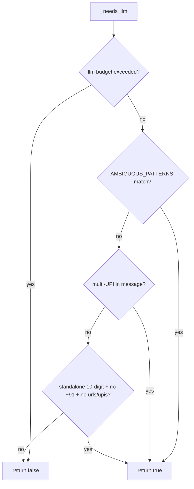
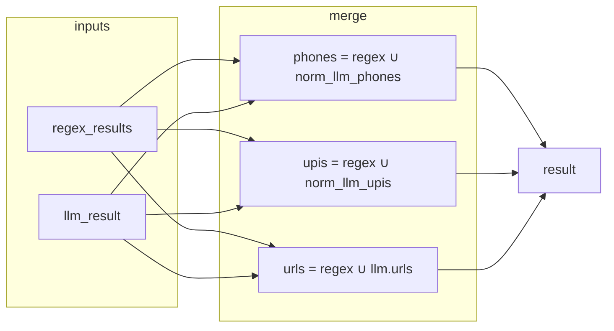
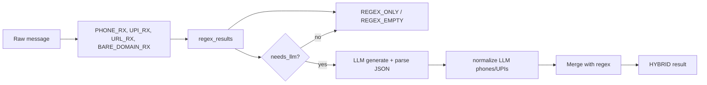

# Extraction Agent – Documentation

A clear guide to the **ExtractionAgent**: what it does, how it works, and how to use it.

---

## What is the Extraction Agent?

The **Extraction Agent** reads scammer messages and pulls out useful intelligence:

- **Phone numbers** (Indian format, e.g. +91 9876543210)
- **UPI IDs** (e.g. scammer@paytm, user@phonepe)
- **URLs** (full links and bare domains like www.fake-bank.in)

It uses a **hybrid approach**: most of the time it uses fast **regex** rules; in tricky cases it can optionally call an **LLM** to decide (e.g. “is this number a phone or an order ID?”).

- **Code:** `agents/extraction_agent.py`
- **Base class:** `BaseAgent`

---

## Two Ways to Use It

| API | When to use | Returns |
|-----|--------------|---------|
| **`extract(message)`** | Fast extraction for phones, UPI, URLs. Use this in pipelines and demos. | `{method, phones, upis, urls, latency_ms, confidence}` |
| **`extract_intelligence(message)`** | Full intelligence schema (identity, infrastructure, tactics, keywords). Use when you need everything for session memory. | Same shape as `SessionMemory.extractedIntelligence` |

---

## Main Workflow: `extract(message)`

This diagram shows the path a message takes through `extract()`.

```mermaid
flowchart TD
    A[extract(message)] --> B{message empty?}
    B -->|yes| C[return EMPTY]
    B -->|no| D[_fast_regex_extract]
    D --> E[_needs_llm?]
    E -->|yes| F{llm_client set?}
    F -->|yes| G[_llm_extract_ambiguous]
    G --> H[Merge regex + LLM]
    H --> I[return HYBRID]
    F -->|no| J[return REGEX_EMPTY]
    E -->|no| K{regex found phones/upis/urls?}
    K -->|yes| L[return REGEX_ONLY]
    K -->|no| M[return REGEX_EMPTY]
```

**In plain words:**

1. **Empty message** → return `EMPTY` (no extraction).
2. **Run regex** → get phones, UPIs, URLs (and bare domains) from the text.
3. **Is this message “ambiguous”?** (e.g. “order #9876543210”, or two UPI providers, or a lone 10-digit number)
   - **Yes + LLM available** → call LLM, then **merge** regex + LLM (regex is never overwritten by empty LLM lists) → return `HYBRID`.
   - **Yes + no LLM** → return `REGEX_EMPTY` (we don’t trust regex alone in that context).
4. **Not ambiguous** → if regex found something, return `REGEX_ONLY`; otherwise `REGEX_EMPTY`.

---

## When Does the LLM Run? (`_needs_llm`)

The LLM is only used when the message looks “ambiguous” so that regex alone might be wrong.



**LLM is used when any of these is true:**

- Message contains **ambiguous patterns:** `order #`, `ref #`, `id :`, `ticket #`, `transaction #`, `invoice #`
- Message mentions **more than one UPI provider** (e.g. paytm and phonepe)
- Message has a **standalone 10-digit number** (starts with 6–9) but **no** `+91`, and regex found **no** URLs or UPIs (could be order ID, not phone)

If the LLM budget is exceeded, we stop calling the LLM and treat as non-ambiguous.

---

## How HYBRID Merges Regex and LLM

When we use the LLM, we **merge** its output with regex. We never throw away regex results just because the LLM returned empty lists.



- **phones:** regex phones + normalized LLM phones (deduped).
- **upis:** regex UPIs + LLM UPIs not already in regex (LLM strings like `"id@paytm"` become `(id, "paytm")`).
- **urls:** regex URLs + LLM URLs (deduped).
- **confidence:** comes from the LLM (`LOW` / `MEDIUM` / `HIGH`).

---

## What `extract()` Returns

| Key | Type | Meaning |
|-----|------|---------|
| `method` | string | `EMPTY` \| `REGEX_ONLY` \| `REGEX_EMPTY` \| `HYBRID` |
| `phones` | list of strings | Indian numbers, e.g. `["919876543210"]` |
| `upis` | list of tuples | `(id, provider)`, e.g. `[("test", "paytm")]` |
| `urls` | list of strings | Full URLs; bare domains normalized to `https://...` |
| `latency_ms` | number | Time taken for the call |
| `confidence` | string | `HIGH` \| `MEDIUM` \| `LOW` (only when not `EMPTY`) |

**Method meanings:**

- **EMPTY** – Input was empty; no extraction.
- **REGEX_ONLY** – Clear patterns; we used only regex and are confident.
- **REGEX_EMPTY** – Message was ambiguous and we had no LLM, or regex found nothing; we return empty (or discard regex in ambiguous case).
- **HYBRID** – Message was ambiguous; we used LLM and merged with regex.

---

## Data Flow: Message → Result



Regex runs first. Then we decide: use only regex, or call the LLM and merge.

---

## What We Extract with Regex (Fast Path)

| Type | Examples |
|------|----------|
| **Phones** | `+91 9876543210`, `9876543210`, `+91-98765-43210` → normalized to `91...` |
| **UPI** | `id@paytm`, `id@phonepe`, `id@ybl`, etc. → `(id, provider)` |
| **URLs** | `https://...`, `http://...` |
| **Bare domains** | `www.fake-bank.in`, `signup.scam-trade.com` → normalized to `https://...` |

Bare domains support multiple labels (e.g. `sub.domain.com`). They are always returned as `https://...` in the URL list.

---

## Full Schema: `extract_intelligence(message)`

When you need the full session-memory intelligence (identity markers, infrastructure, tactics, keywords), use `extract_intelligence()`. It does **not** use the LLM; it’s regex and keyword-based only.

```mermaid
flowchart TD
    A[extract_intelligence(message)] --> B[Extract identity markers]
    A --> C[Extract URLs and domains]
    A --> D[Find tactic keywords]
    A --> E[Find suspicious keywords]
    B --> F[identityMarkers]
    C --> G[infrastructure]
    D --> H[psychologicalTactics]
    E --> I[suspiciousKeywords]
    F --> OUT[SessionMemory.extractedIntelligence]
    G --> OUT
    H --> OUT
    I --> OUT
```

**Identity markers:** phones, emails, UPI IDs, bank accounts.  
**Infrastructure:** phishing URLs, domains.  
**Psychological tactics:** urgency, authority, threats, scarcity.  
**Suspicious keywords:** verification, payment, account, remote-access terms.

---

## Configuration

- **`llm_client`** – Optional. If `None`, we never call the LLM; ambiguous messages yield `REGEX_EMPTY`.
- **`config`** – Optional dict:
  - `llm_budget` – Max LLM calls per agent (default 1000).
  - `session_llm_budget` – Per-session limit (default 3).
  - `llm_enabled` – Master switch (default True).

---

## Tests and Demo

- **Tests:** `tests/test_extraction_agent.py` – 15 tests for `extract()` and `extract_intelligence()`.
- **Demo:** `demo/extraction_demo.py`
  - Regex only: `python demo/extraction_demo.py`
  - With LLM: `python demo/extraction_demo.py --llm` (needs API key in `.env`)
  - Single message: `python demo/extraction_demo.py --msg "Your message here"`

---

## Quick Reference

| Topic | Summary |
|-------|---------|
| **Primary API** | `extract(message)` → `{method, phones, upis, urls, latency_ms, confidence}` |
| **Full schema** | `extract_intelligence(message)` → SessionMemory.extractedIntelligence shape |
| **Strategy** | 95% regex (fast), 5% LLM for ambiguous cases |
| **Escalation** | order/ref/ticket/invoice patterns, multi-UPI, standalone 10-digit without URLs/UPIs |
| **Merge rule** | HYBRID = regex ∪ LLM; empty LLM lists never overwrite regex |
| **URLs** | Full URLs + bare domains (e.g. www.x.in, sub.domain.com) normalized to https |
| **Phones** | Indian mobile normalized to 91-prefix |
| **UPIs** | `(id, provider)` tuples |
